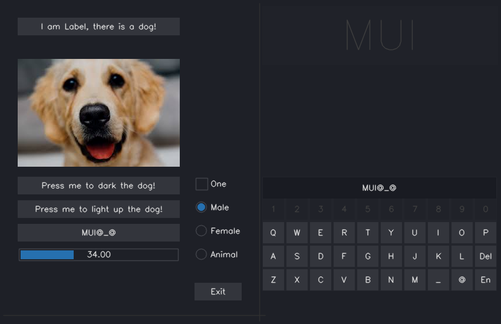

Mui
---


Mouse oriented ui library, which maintains a few states for each widget for squeezing the performance.It's very close to IMGUI, but with minimum states maintained to avoid unnecessary rendering.

Creating UI with Mui is very fast (check out demo.cpp), customizing or writing your own widgets is very easy (check out widget implementations in mui.h).





About Sui (sui.h, sui.c):

OpenCV's UI behaves differently for different widget frameworks. On Linux systems, there're always something inconsistent among different backends in Qt, GTK, GTK2.0 or Carbon, etc. Sui is created based on X11 to provide a consistent UI experience on Linux system when using Mui. It's based on X11 directly which saves lots of memory and CPU time. Mui is designed to not use any GPU resources, so that my computer vision codes could occupy the GPU as much as possible. It's being used on some embded systems now, working smoothly.

Sui currently is only working with X11. Later will be combined with https://github.com/blackball/gui (based on Win32 APIs) to support Windows systems. 


```
make demo # without Sui
```

```
make demo_sui # with Sui
```

